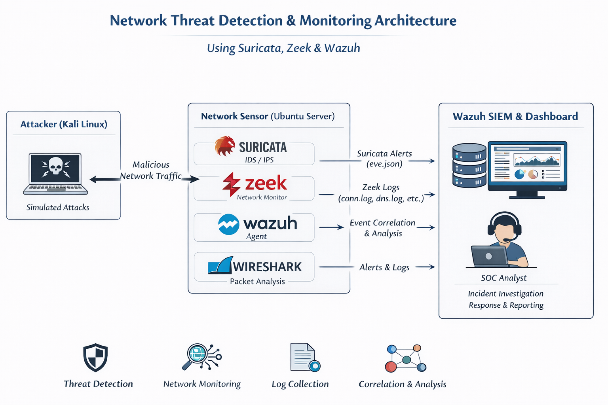

## Network Detection and Response (NDR) SOC Lab with Packet Analysis.



---

## 📌 Project Overview

This project implements an **open-source Network Detection and Response (NDR) SOC lab** designed to simulate **real-world security monitoring, detection, correlation, and investigation workflows** used in modern Security Operations Centers (SOCs).

The lab integrates **Suricata**, **Zeek**, **Wazuh**, and **Wireshark** to provide end-to-end visibility into network traffic — from detection and alerting to correlation and packet-level forensic analysis.

The primary goal is to build **SOC-ready skills** by detecting suspicious network activity, enriching alerts with context, correlating events, and validating incidents through deep packet inspection.

---

## 🎯 Project Objectives

* Simulate **real-world SOC network monitoring**
* Understand how **network traffic flows through detection engines**
* Learn the difference between **signature-based detection** and **behavioral analysis**
* Correlate network events using shared flow identifiers
* Perform **packet-level forensic analysis**
* Build practical **SOC L1/L2 investigation skills**

---

## 🏗️ Architecture Overview

```
Network Traffic (Live or PCAP)
        ↓
 Network Interface / PCAP Capture
        ↓
 ┌──────────────────────────┐
 │        Suricata           │
 │  (Intrusion Detection)   │
 │  - Signatures            │
 │  - Alerts                │
 │  - Flow metadata         │
 └─────────────┬────────────┘
               ↓
 ┌──────────────────────────┐
 │           Zeek            │
 │  (Network Security       │
 │   Monitoring)            │
 │  - conn.log              │
 │  - dns.log               │
 │  - http.log              │
 │  - ssl.log               │
 └─────────────┬────────────┘
               ↓
 ┌──────────────────────────┐
 │          Wazuh            │
 │  (SIEM & Correlation)    │
 │  - Log collection        │
 │  - Event correlation     │
 │  - Alerting              │
 └─────────────┬────────────┘
               ↓
 ┌──────────────────────────┐
 │        Wireshark          │
 │  (Packet Analysis)       │
 │  - PCAP inspection       │
 │  - Payload analysis      │
 └──────────────────────────┘
               ↓
     SOC Investigation & Response
```

---

## 🔍 Tool Breakdown

### 🛡️ Suricata – Intrusion Detection System (IDS)

Suricata is responsible for **detecting malicious or suspicious activity** using:

* Signature-based detection (rules)
* Protocol awareness
* Threat intelligence feeds

It answers the question:

> **“Is this network traffic potentially malicious?”**

**Key Outputs:**

* Alerts (`eve.json`)
* Flow records
* DNS and HTTP events

---

### 🧠 Zeek – Network Security Monitoring (NSM)

Zeek provides **deep visibility and context** into network activity rather than direct alerts.

It extracts rich metadata such as:

* Connection logs (`conn.log`)
* DNS activity (`dns.log`)
* HTTP requests (`http.log`)
* TLS/SSL details (`ssl.log`)
* File transfer metadata

It answers the question:

> **“What exactly happened on the network?”**

---

### 🧩 Wazuh – SIEM & Event Correlation

Wazuh acts as the **central SOC platform** for:

* Collecting Suricata and Zeek logs via the Wazuh agent
* Parsing and normalizing events
* Correlating alerts using shared identifiers (e.g., Community ID)
* Generating actionable security alerts

It answers the question:

> **“Which events matter and how are they related?”**

---

### 🔬 Wireshark – Packet-Level Forensic Analysis

Wireshark is used for **deep packet inspection and forensic validation**.

It allows analysts to:

* Inspect raw packets (PCAPs)
* Validate IDS alerts
* Analyze payloads and protocols
* Confirm exploitation or data exfiltration

It answers the question:

> **“What do the actual packets reveal?”**

---

## ⚖️ Why Use These Tools Together?

| Tool      | Primary Strength                   |
| --------- | ---------------------------------- |
| Suricata  | Detects known threats and exploits |
| Zeek      | Provides behavioral context        |
| Wazuh     | Correlates and prioritizes events  |
| Wireshark | Confirms incidents at packet level |

Together, they provide a **complete NDR and SOC investigation workflow** commonly used in enterprise environments.

---

## 🔄 Detection & Investigation Workflow

1. Network traffic is captured (live or PCAP)
2. **Suricata** detects suspicious activity
3. **Zeek** logs detailed protocol metadata
4. **Wazuh** collects and correlates events
5. Analyst investigates alerts and related logs
6. **Wireshark** is used to validate findings
7. Incident is confirmed and documented

---

## 🧪 Example Detection Scenarios

* Port scanning and reconnaissance
* Malware command-and-control (C2) communication
* DNS tunneling or abnormal DNS patterns
* Suspicious HTTP beaconing
* Unauthorized file downloads

---

## 🔧 Implementation Highlights

* Live traffic and PCAP-based analysis
* Suricata rule tuning and alert analysis
* Zeek log correlation and context enrichment
* Centralized monitoring with Wazuh
* Packet-level investigation using Wireshark

---

## 🎓 Skills Demonstrated

* Network traffic analysis
* IDS alert triage
* Event correlation and investigation
* Packet-level forensic analysis
* SOC L1/L2 workflows
* NDR architecture understanding

---

## 🧠 Key Takeaway

> **Suricata detects the threat, Zeek explains the behavior, Wazuh correlates the events, and Wireshark confirms the truth in the packets.**

This project demonstrates how multiple open-source tools can be combined to build a powerful, SOC-ready Network Detection and Response platform.

---

## 👤 Author

**Olusegun Fajobi**
Cybersecurity Engineer (Blue & Red Team)
GitHub: [https://github.com/samfajobi](https://github.com/samfajobi)
